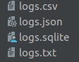
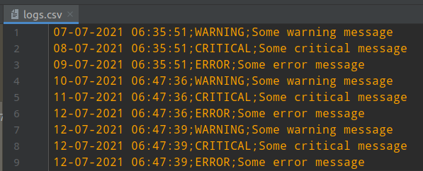
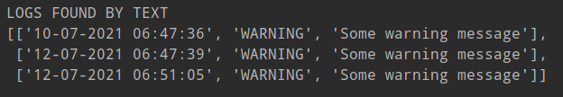
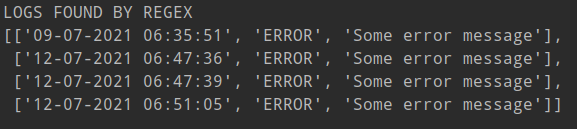
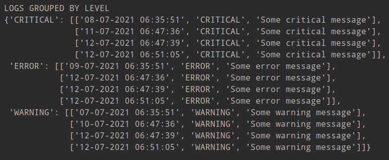
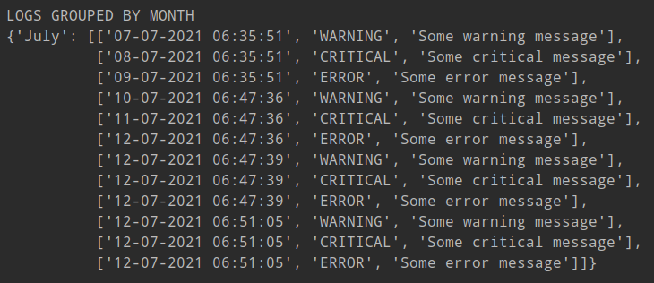

# Recruitment For Intern 07-2021.
### Mariusz Rogawski

---
## Logger

---

### General informations

Logger is a program that saves all triggered events by default to files with extensions:

 * .json
 * .csv
 * .sqlite
 * .txt

Saved logs in files can be read according to specific methods:
* Search logs by text that contain log messages
* Searching for logs by matching the text from the log message to the regular expression pattern
* Grouping of logs according to their level
* Grouping of logs by the month of their creation

Additionally, in each of the above methods, you can enter the date range for which the logs should be displayed.

---

### Installation

The logger can be installed from github, from a terminal using a command

    $ pip install git+https://github.com/Mairon88/Recruitment_task_backend_internship_2021_07.git#egg=logmaster

Github will ask you to enter your login and password for your github account before installing the library.

### How to use?

After installing the library in the project, in order to freely use its functionality, you must import
relevant modules as shown below:

    from Recruitment_task_backend_internship_2021_07.handlers import JsonHandler, CSVHandler, SQLLiteHandler, FileHandler
    from Recruitment_task_backend_internship_2021_07.profil_logger import ProfilLogger
    from Recruitment_task_backend_internship_2021_07.profil_logger_reader import ProfilLoggerReader

Then create handlers for reading and writing files in the format we are interested in, as shown below:

    json_handler = JsonHandler("logs.json")
    csv_handler = CSVHandler("logs.csv")
    sql_handler = SQLLiteHandler("logs.sqlite")
    file_handler = FileHandler("logs.txt")

In the example, the handlers were saved in the list and passed as a parameter to the ProfileLogger class.

    handlers = [json_handler, csv_handler, sql_handler, file_handler]
    logger = ProfilLogger(handlers)

Using the logger object and the methods we have at our disposal, we can:
* set the minimum log level from which the file will be saved (levels from the lowest to the highest -> 'DEBUG', 'INFO', 'WARNING', 'ERROR', 'CRITICAL')
  
        logger.set_log_level('DEBUG')

* call log to write, below is log call for each level
    
        logger.info("Some info message")
        logger.warning("Some warning message")
        logger.debug("Some debug message")
        logger.critical("Some critical message")
        logger.error("Some error message")

  the above call writes logs to each file pointed to by handlers

The ProfileLoggerReader class allows you to read logs from files, which takes the appropriate handler as a parameter.

    log_reader_json = ProfilLoggerReader(handler=json_handler)
    log_reader_csv = ProfilLoggerReader(handler=csv_handler)
    log_reader_sqlite = ProfilLoggerReader(handler=sql_handler)
    log_reader_txt = ProfilLoggerReader(handler=file_handler)

The objects created above store the read data from the cheeks in the form of a list.

To display the appropriate logs, the above objects have methods:

* find_by_text
    
    this method looks for logs through the text containing the log messages
  
        log_reader_json.find_by_text("info",'07-07-2021 16:00:00','07-08-2021 22:20:00')

    The first argument should be the text -> str, which will be found in the created logs, and optionally dates
    in the format as shown in the snippet above.
  

* find_by_regex
    
    this method looks for logs by matching the text in the log message to a regular expression pattern

        log_reader_json.find_by_regex(r"\w\w\w\w \w\w\w\w ", '07-07-2021 16:00:00','07-08-2021 22:20:00')

    The first argument should be regex -> str, which will be found in the created logs, and optionally dates
    in the format as shown in the snippet above.
    

* groupby_level
    
  this method groups the logs according to their level

        log_reader_json.groupby_level('07-01-2021 16:00:00','07-12-2021 22:20:00')

    optionally dates in the format as shown in the above snippet may be given as arguments.
    

* groupby_month
this method groups the logs according to the month in which the log was created in the form of a dictionary

        log_reader_json.groupby_level('07-01-2021 16:00:00','07-12-2021 22:20:00')

    optionally dates in the format as shown in the above snippet may be given as arguments.

### Sample usage

The saved data according to the following section creates the following files

      json_handler = JsonHandler("logs.json")
      csv_handler = CSVHandler("logs.csv")
      sql_handler = SQLLiteHandler("logs.sqlite")
      file_handler = FileHandler("logs.txt")
      
      handlers = [json_handler, csv_handler, sql_handler, file_handler]
      logger = ProfilLogger(handlers)
  
      logger.set_log_level('WARNING')
      logger.info("Some info message")
      logger.warning("Some warning message")
      logger.debug("Some debug message")
      logger.critical("Some critical message")
      logger.error("Some error message")

which according to the value set in set_log_level should contain
  logs from the WARNING level.

Reading files using the methods below

    log_reader_csv = ProfilLoggerReader(handler=csv_handler)
    log_reader_csv.find_by_text("ing me", '10-07-2021 00:00:00','07-08-2021 22:20:00') 
    log_reader_csv.find_by_regex(r"\w\w\w\w e", '07-07-2021 00:00:00','10-08-2021 22:20:00')
    log_reader_csv.groupby_level('07-01-2021 16:00:00','07-12-2021 22:20:00')
    log_reader_csv.groupby_month('07-01-2021 16:00:00','07-12-2021 22:20:00')

will display a list of logs

Incorrect date entry, e.g. end date is earlier than start date

    log_reader_csv.groupby_month('07-12-2021 22:20:00','07-01-2021 00:00:00')

will display a message

    WARNING: Start date should be earlier than end date

